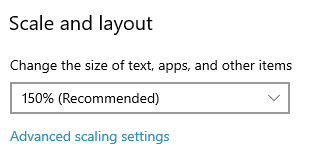

# CharmMM

CharmMM is a tool to perfectly set Windows wallpaper on multi-monitors. 

## Motivation
In multi-monitor settings, Windows built-in wallpaper does not work well if you have displays like that:

Either the wallpaper get cropped, or there is a lot of blank area on screen...

This tool can help you get perfect wallpaper set. 

## Installation
- Run **npm install** to install project dependencies.
- Set **PictureFolder** in *config.json* to the folder containing your wallpapers.
- In Windows Background settings, **set *Choose a fit* option to *Tile***
  
  
- The default time interval to change background is 10 minutes, you can change by setting *INTERVAL* variable in *install.bat*
- Run *install.bat* to install the script as a job in Windows Task Scheduler, and create a desktop shortcut with the hotkey **CTRL+ALT+B**. 
- Run *uninstall.bat* to uninstall.

## Known issues
1. If you change the "Scale and layout" in Display Settings of Windows, chance is the app will fail to set wallpapers correctly. 
   
    
  
    Reason for that is the dependent [systeminformation](https://www.npmjs.com/package/systeminformation) library has some bug detecting graphics information. Hopefully it [will be fixed in the v6](https://github.com/sebhildebrandt/systeminformation/issues/346). 

## Video demo
//TODO

## [Lisence](./LICENSE)
- Sample wallpapers are from https://www.pexels.com/ under [this license](https://www.pexels.com/license/).
- The shortcut icon is from https://iconarchive.com/ under [CC Attribution-Noncommercial 4.0](https://creativecommons.org/licenses/by-nc/4.0/).
