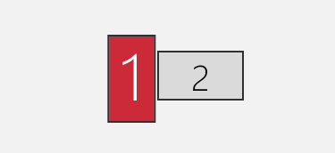
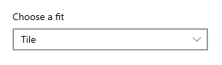

[](https://github.com/toowhite/CharmMM/issues)

[](https://www.npmjs.com/package/charm-mm)

# CharmMM

CharmMM is a tool to perfectly set Windows wallpaper on multi monitors/displays. 

## Motivation
Most software developers use more than one display in work to boost productivity, however, most of them just set boring wallpapers. 

Even some customized wallpaper is set, in multi-display settings, Windows built-in wallpaper does not work well if you have displays like that:



Either the wallpaper get cropped, or there is a lot of blank area on screen...

This tool can help you get perfect wallpaper set. The wallpapers are searched and downloaded from [Pexels](https://www.pexels.com/), specified by your keywords. More features are to be added.

## Prerequisites

- [Wget](https://www.gnu.org/software/wget/) is installed. 
- In Windows Background settings, **set *Choose a fit* option to *Tile***
  
  

## Installation
- Run `npm install -g charm-mm` to install the package.
- Usage: `charm-mm --config config.yml`. 
  Read *config.yml.sample* and modify it to create *config.yml*.

## To-dos
See https://github.com/users/toowhite/projects/1

## Troubleshooting
### UnauthorizedAccess for running GetDisplays.ps1 script
You get error like this:
```
... path/to/charm-mm...GetDisplays.ps1 : File C:\Users\Chevy Li\AppData\Roaming\npm\node_modules\charm-mm\GetDisplays.ps1 cannot
be loaded because running scripts is disabled on this system. For more information, see about_Execution_Policies at https:/go.microsoft.com/fwlink/?LinkID=135170.
At line:1 char:1
+ ... path/to/charm-mm... ...
+ ~~~~~~~~~~~~~~~~~~~~~~~~~~~~~~~~~~~~~~~~~~~~~~~~~~~~~~~~~~~~~~~~~~~~~
    + CategoryInfo          : SecurityError: (:) [], PSSecurityException
    + FullyQualifiedErrorId : UnauthorizedAccess
```
That's due to PowerShell execution restrictions. To solve, as suggested in the error message, you have to change the ExecutionPolicy of PowerShell. For example, change policy to AllSigned for current user by running this command in an  Powershell (running as Administrator):

```
Set-ExecutionPolicy -ExecutionPolicy AllSigned -Scope CurrentUser
```


## License
MIT License
