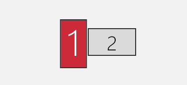
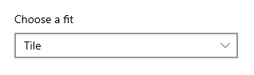

# CharmMM

CharmMM is a tool to perfectly set Windows wallpaper on multi-monitors. 

## Motivation
In multi-monitor settings, Windows built-in wallpaper does not work well if you have displays like that:

Either the wallpaper get cropped, or there is a lot of blank area on screen...

This tool can help you get perfect wallpaper set. 

## Install instructions
- Global dependencies is Node.js(14.x); run **npm install** to install project dependencies.
- Set **PictureFolder** in *config.json* to the folder containing your wallpapers.
- In Windows Background settings, **set *Choose a fit* option to *Tile***
  
- The default time interval to change background is 10 minutes, you can change that by changing *INTERVAL* variable in *install.bat*
- Run *install.bat* to install the script as a task in Windows Task Scheduler.
- Run *uninstall.bat* to uninstall.

## [Lisence](./LICENSE)
