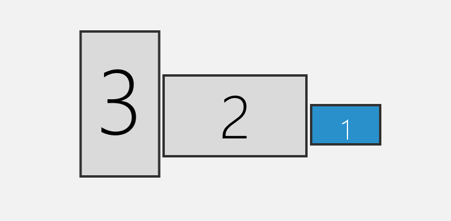

# CharmMM

CharmMM is a tool to perfectly set Windows wallpaper on multi monitors/displays. 

## Motivation
Most software developers use more than one display in work to boost productivity, however, most of them just set boring wallpapers. 

Even some customized wallpaper is set, in multi-display settings, Windows built-in wallpaper does not work well if you have displays like that:

Either the wallpaper get cropped, or there is a lot of blank area on screen...

This tool can help you get perfect wallpaper set. The wallpapers are searched and downloaded from [Pexels](https://www.pexels.com/), specified by your keywords. More features are to be added.

## Prerequisites

- [Wget](https://www.gnu.org/software/wget/) is installed. 
- In Windows Background settings, **set *Choose a fit* option to *Tile***
  
  

## Installation
- Run `npm install -g charm-mm` to install the package.
- Usage: `charm-mm --config config.yml`. 
  Read *config.yml.sample* and modify it to create *config.yml*.

## To-dos
See https://github.com/users/toowhite/projects/1

## License
MIT License
